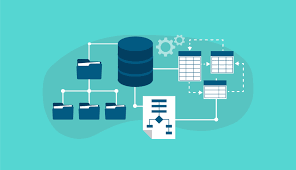

# Estructura de datos
En este repositorio podrás encontrar temas relacionados con estructuras de datos implementadas en **Java** como:
1.	Tipos de datos abstractos
2.	Recursividad
3.	Arreglos
4.	Genéricos
5.	Listas
6.	Pilas
7.	Colas
8.	Métodos de ordenamiento y búsqueda
9.	Árboles

